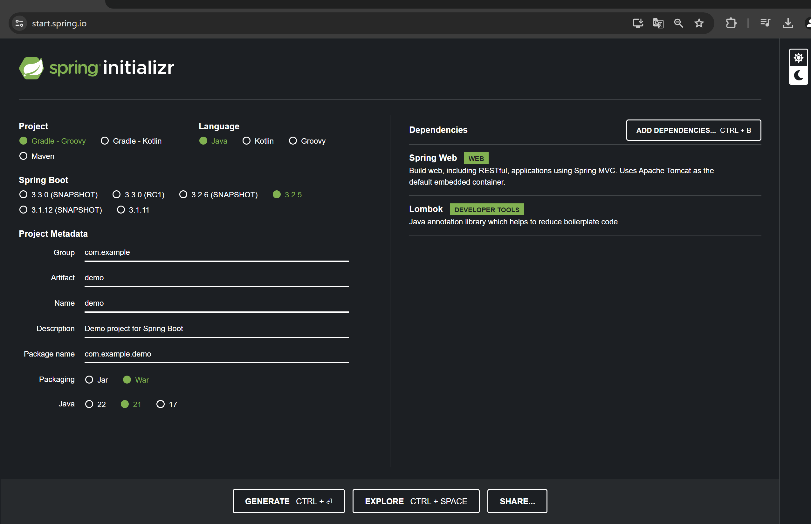
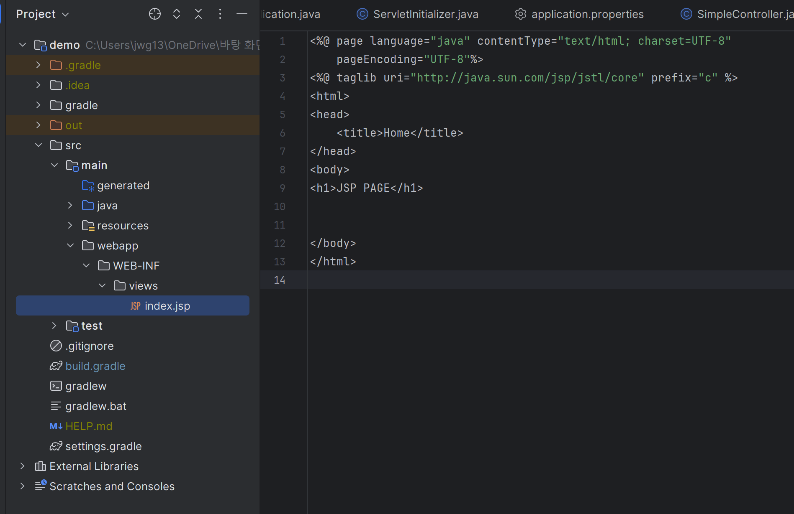
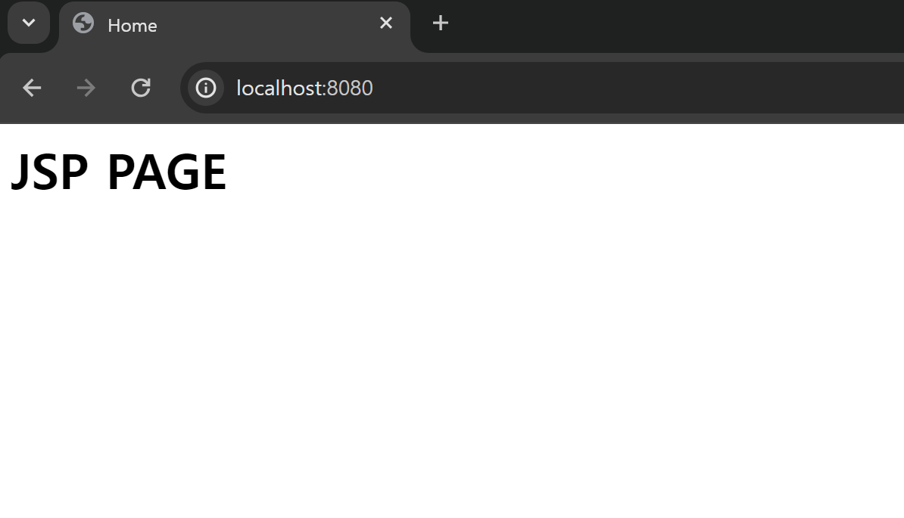

# INIT_SPINGBOOT_WITH_JSP

참고링크
---
> - <br>

|-|-|
|-|-|
|UTF-8 설정|[바로가기](https://eroul-ri.tistory.com/10)|
|Intellij 자동 import 설정|[바로가기](https://tychejin.tistory.com/340)|
|Intellij 깃허브 연동|[바로가기](https://goddaehee.tistory.com/249)|
|Intellij DataBase Navigatoer|[바로가기](https://developer-ping9.tistory.com/172)|
|Tabnine 코드 자동완성 플러그인|[바로가기](https://yehza.tistory.com/436)|
|Emmet|[바로가기](https://blog.yijunho.com/181)|
|git Toll Box|[바로가기](https://devgoat.tistory.com/26)|
|인텔리제이 <br>단축키 학습 플러그인|[바로가기](https://jeonghwan-kim.github.io/dev/2021/10/29/return-to-intellij.html)<br>[바로가기](https://hbase.tistory.com/447)|
|괄호구분 플러그인<br>(색상별로)|[바로가기](https://hbase.tistory.com/436)|

---
#
---


start.spring.io
---
>-<br>

|-|
|-|
||

```

```

---
#
---


build.gradle
---
>-<br>

|-|
|-|
|-|

```
dependencies {
	implementation 'org.springframework.boot:spring-boot-starter-web'
	compileOnly 'org.projectlombok:lombok'
	annotationProcessor 'org.projectlombok:lombok'
	//providedRuntime 'org.springframework.boot:spring-boot-starter-tomcat'
	testImplementation 'org.springframework.boot:spring-boot-starter-test'

	//JSP
	implementation 'org.apache.tomcat.embed:tomcat-embed-jasper' // 추가

	//JSTL
	implementation 'jakarta.servlet:jakarta.servlet-api' //스프링부트 3.0 이상
	implementation 'jakarta.servlet.jsp.jstl:jakarta.servlet.jsp.jstl-api' //스프링부트 3.0 이상
	implementation 'org.glassfish.web:jakarta.servlet.jsp.jstl' //스프링부트 3.0 이상
}

```

---
#
---


application.properties
---
>-<br>

|-|
|-|
|-|

```
spring.application.name=demo

#Tomcat Server Port Setting
server.port=8080

#UTF-8 Setting
spring.servlet.filter.encoding.filter-name=encodingFilter
spring.servlet.filter.encoding.filter-class=org.springframework.web.filter.CharacterEncodingFilter
spring.servlet.filter.encoding.init-param.encoding=UTF-8
spring.servlet.filter.encoding.init-param.forceEncoding=true
spring.servlet.filter.encoding.url-pattern=/*

# JSP Setting
spring.mvc.view.prefix=/WEB-INF/views/
spring.mvc.view.suffix=.jsp
# JSP Auto-Configuration
server.servlet.jsp.init-parameters.development=true
```

---
#
---


webapp/WEB-INF/views/index.jsp
---
>-<br>

|-|
|-|
||

```

```

---
#
---


SimpleController
---
>-<br>

|-|
|-|
|-|

```
@Controller
@Slf4j
public class SimpleController {

    @GetMapping("/index")
    public void index(){
        log.info("GET /index...");
    }

}

```

---
#
---


확인
---
>-<br>

|-|
|-|
|| 

```

```

